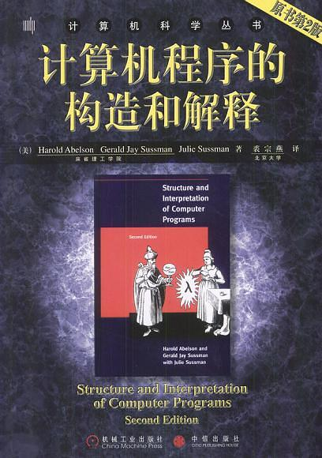

# SICP(计算机程序的构造和解释)练习代码
&emsp;&emsp;由于找不到关于这本书的简介，故采用[百度百科](https://baike.baidu.com/item/%E8%AE%A1%E7%AE%97%E6%9C%BA%E7%A8%8B%E5%BA%8F%E7%9A%84%E6%9E%84%E9%80%A0%E5%92%8C%E8%A7%A3%E9%87%8A/6450283?fr=aladdin)中的评论。
1. 涵盖面很广。从数据抽象、过程抽象、迭代、高阶函数等编程和控制系统复杂性的思想，到数据结构和算法，到编译器/解释器、编程语言设计。MIT这门课的课程讲义（在MIT OCW里可找到）里还增加了面向对象编程的内容。虽然很多内容涉及并不深入，但是这是MIT EECS（电子工程与计算机科学系）的第一门专业基础课（6.001），也就是说MIT计算机专业的学生在进入大学之后，在这门课之前没有上过其它编程、软件、计算机方面的课程。从这个角度看，起点是非常高的。其它大学的学生在倒腾C语言的时候，MIT的学生在思考设计语言和系统。
2. 用解释语言而不是编译语言来阐述思想，简化了数据类型、运行环境相关的一些细节，另外Scheme/Lisp有着极其简练、但功能极其强大和灵活的语法，这些都使阅读者更多地将精力集中在思想上，而不是语法细节上，颇为适合学习，只是Scheme的执行效率可能较低，表达力可能不够”丰富“，不一定适合于实际开发。
3. MIT OCW 6.001里有几个project，都很有意思。其中一个是设计一个类似于Google使用的web爬虫！虽然实际上没这么可怕，做了很多简化，集中在树的遍历与索引表的建立和查询上，但是仍然可以从中看出教授的视野和对学生的要求。
4. 现在MIT EECS已经取消了这门课，6.001的EECS介绍性功能被6.01和6.02两门课程替代，另外新增了6.005（软件），6.006（算法），是不是因为6.001起点太高或有点偏呢？（对于EE方向的学生来说似乎有点偏。）尽管如此，作为一门在MIT EECS教授了20多年的经典课程，仍然有其价值。
5. MIT EECS没有专门教授C、C++、Java等编程语言的课，一般都是要求学生用很短的时间自学。比如6.004要用到C，6.005要用到Java，6.006要用的Python，教授会要求学生在课程开始的几个星期内自学掌握这些语言。
6. SICP中译本翻译有些问题。比如表述符号（变量）和值的binding关系时，binding一词应翻译成“绑定”，而不是“约束”。
7. MIT Scheme相当难用，简直是石器时代的开发工具：）（指编辑和解释器，不是语言）。
8. 有人说看这本书主要看第四第五章。这不是一件容易的事情，尤其对于我们这个计算机教育落后的国家。好在还有平易近人的一二三章，基本上可以在网上找全习题答案。
9. 有人说scheme是程序设计语言中的皇后，更多的人从来没见过这条恐龙。打工族翻上几页后的第一个感觉是，这本书到底有什么用？如果你对数据结构算法编译原理模块设计足够自信，如果你的日常工作是复制粘贴字符串并且很满意这个结果，再或者如果你是mit的电子工程学士，算啦。
10. 最后有一点，全部的习题能不落下尽量做，数量很多，主要是需要很多的时间思考，收获也不是一般的

## 使用说明
1. 练习代码包括《程序设计思想(sicp-py)》中的代码和《SICP》的练习代码，均采用python编写。
3. src/book_sicp_py目录中为《程序设计思想(sicp-py)》的代码，文件命名为XXX_1_4.py表示1.4节的练习代码。
2. 关于本笔记中的练习代码，已经消缺了书中代码的错误，可以很方便地执行程序。  

## 选用的《计算机程序的构造和解释》版本

> 书名：计算机程序的构造和解释(原书第2版) 
> 作者：Harold Abelson、Gerald Jay Sussman、Julie Sussman 
> 译者：裘宗燕 
> 版次：2004年2月 

电子书的百度网盘地址：链接: https://pan.baidu.com/s/1T5xmNyQ5i4UlDFqWSXmeOw 提取码: n5sw 

## 主要贡献者（按首字母排名）
[@胡锐锋-天国之影-Relph](https://github.com/Relph1119)

## LICENSE
[GNU General Public License v3.0](https://github.com/relph1119/sicp-in-python-notes/blob/master/LICENSE)